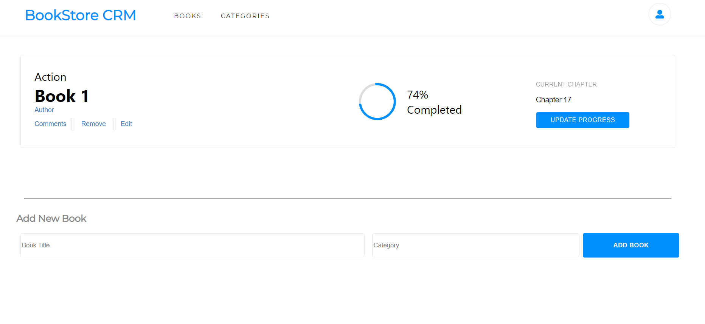

###  Book-store

## Description
- This project is about a bookstore where user can store the title and choose category of thier favourite books, and can also remove books, 

## Built With
This project is build with:
- CSS
- React

 

[Link](https://book-store-crm.netlify.app/)

## Getting Started;

To get the content of this project locally you need to run this command in your terminal:
- ` git clone git@github.com:faizi2500/book-store.git`

For tracking linter errors locally you need to follow these steps:
- After cloning the project you need to run this command
  > `npm install`
  > This command will download all the dependancies 

- For tracking the linter errors in JavaScript file run:
  > `npx eslint .`
- And for tracking the linter errors in CSS file run:
  > `npx stylelint "\*_/_.{css,scss}"`

## Author

👤 **Faizan Zahid**

- GitHub: [@faizi2500 ](https://github.com/faizi2500)
- Twitter: [@faizi_250 ](https://twitter.com/Faizy_250)
- LinkedIn: [@faizan2500](www.linkedin.com/in/faizan2500)

## :handshake: Contributing
Feel free to check the [issues page](https://github.com/julie-ify/bookstore-react/issues)

## Show your support
Give a :star: if you like this project!

## Acknowledgments
- Thanks to [Microverse](www.microverse.org) team that help with the tamplete of this project

## 📝 License
This project is [MIT](./MIT.md) licensed.